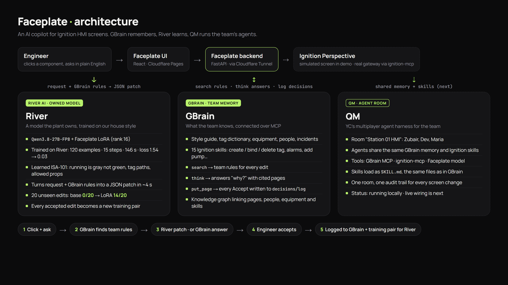
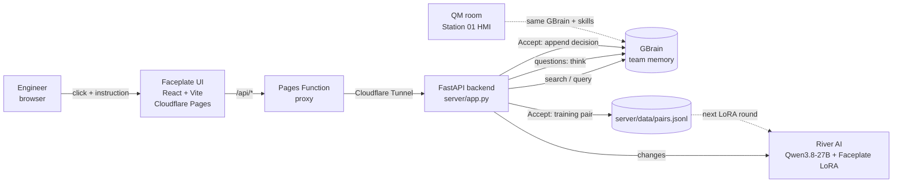

# Faceplate

**An AI copilot for industrial HMI screens that learns your team's standards.**

Click any component on an Ignition Perspective screen (a pump, a tank, the alarm table), say what you want in plain English, and Faceplate proposes the change: in your team's house style, grounded in your team's memory, produced by a model your company owns.

- **Live demo:** https://faceplate-demo.pages.dev
- **Built at:** YC *Own Your Intelligence* hackathon (GBrain · QM · River · Memorable), San Francisco, Sep 27 2026
- **Sponsor tech used:** GBrain (team memory + LLM), River AI (Qwen LoRA training), QM (multiplayer agent harness)

---

## The problem

Controls engineers build HMI screens for plants in Inductive Automation's **Ignition**. Every team has an HMI standard, usually a version of **ISA-101**: gray for normal, color only for abnormal, fixed tag naming, units always shown. That standard lives in one senior engineer's head and a PDF nobody opens.

The result:
- Every integrator builds screens differently. Our demo plant has old screens where a contractor used **green for "running"**, which breaks the standard.
- Decisions get lost: *why* is the tank HI alarm at 85%? Who asked for alarms on the left?
- Reviews and rework eat days.
- Plant (OT) networks often **can't send data to a hosted AI**, so the model should be one the company owns.

## What Faceplate does

1. **Click** a component on the pump station screen.
2. **Ask** in plain English, e.g. "show running state per our standard", "only show high-priority alarms", or "what is this? explain it to me".
3. Faceplate **searches GBrain** for the team's rules, equipment pages, incidents and past decisions.
4. The request goes to a **model**:
   - A **change** goes to our **River-trained Qwen3.8 LoRA**, which returns a JSON props patch in the house style.
   - A **question** goes to **GBrain `think`**, which answers from team memory with citations.
5. The engineer sees the **diff, the rationale, and the GBrain pages it used**, then clicks **Accept**.
6. On Accept the change applies on screen, a line is **written to GBrain `decisions/log`**, and an **(instruction, before, after) training pair** is saved for the next LoRA round.
7. Every step shows up live in the **activity feed**. Receipt popups show exactly where each request went: backend, then GBrain search, then the model.

---

## Architecture





| Layer | Tech | Where |
|---|---|---|
| UI | React 19 + Vite + TypeScript. Manrope / JetBrains Mono fonts. Design modeled on motionsites' *Finance Assistant* | `web/` |
| Fallback UI | Earlier dark control-room UI, fully functional | `web-v2/`, git tag `ui-v2-dark` |
| Hosting | Cloudflare Pages (`faceplate-demo`) + a Pages Function that proxies `/api/*` | `web/functions/api/[[path]].js` |
| Backend | FastAPI + uvicorn on `127.0.0.1:8000`, exposed through a Cloudflare quick tunnel | `server/app.py` |
| Team memory + LLM | GBrain (hosted, gbrain.io) over MCP streamable HTTP | `server/gbrain_client.py` |
| Owned model | River AI: LoRA on `Qwen/Qwen3.8-27B-FP8` | `model/` |
| Agent harness | QM (yc-software/qm), running locally | see the QM section |
| Agent skills | 15 Ignition skills (SKILL.md) | `skills/ignition/` |

---

## GBrain: the team's memory (and a second brain for the model)

[GBrain](https://github.com/garrytan/gbrain) is a memory layer for people and AI agents: typed markdown pages, a knowledge graph with links, hybrid search, and an LLM "think" layer that answers with citations. We use the **hosted workspace at gbrain.io**, connected over **MCP** (`https://gbrain.io/mcp`, bearer token kept in the gitignored `.env`).

### How Faceplate uses GBrain

| GBrain tool | Used for |
|---|---|
| `search` | Every `/api/edit`: finds the top team rules and pages for the instruction and component. They're shown in the UI as "Rules used from GBrain". |
| `query` | Concept search with multi-query expansion, used in seeding and verification |
| `think` | Answers questions ("why is P-103 faulted?") with citations. It is also the LLM fallback when River isn't available. The backend reported `modelUsed: opus-4-7`. |
| `get_page` / `put_page` | Read and append to `decisions/log` on Accept and on alarm Ack |
| `add_link` | Builds the knowledge graph: 172 links for the plant data, 97 for the skills |
| `workspace_write` / `list_skills` | Registers the Ignition skills in GBrain's native skill catalog |

### What's in the brain

Seeded by `server/seed_gbrain.py`, which is safe to re-run. The company and people are fictional demo data.

| Area | Pages |
|---|---|
| Standards | `hmi/style-guide`: ISA-101 rules, colors, alarms, trends, units, ownership |
| Plant | `plant/station-01-tags`: tag convention `[default]Station01/<Equip>/<Point>` |
| Equipment | `plant/equipment/p-101`, `p-102`, `p-103` (P-103 has a bearing-fault history, replacement 2026-10-04), `t-101`, `t-102` (HI 85 / LO 15), `v-201`, `v-202`, `ft-301` |
| Company | `company/bayview-water`: Bayview Water District runs Pump Station 01 on Ignition 8.3 |
| People | `people/zubair` (HMI lead), `people/maria-chen` (night-shift supervisor), `people/dev-patel` (pumps owner), `people/sam-okafor` (contractor who built the old green-for-running screens) |
| History | `incidents/2026-08-14-t102-near-overflow` (why HI is 85%), `requests/night-shift-alarm-cleanup`, `sops/pump-changeover` |
| Decisions | `decisions/log`: dated decisions. Faceplate appends a line on every Accept and every alarm Ack. |
| QM | `qm/rooms/station-01-hmi`: the team's QM room, its members and tools, and how a request flows |
| Project | `projects/faceplate`, linked to everything above |
| **Skills** | `skills/ignition/index` plus the 15 skills below |

### Ignition skills (teaching agents to operate Ignition)

Each skill covers purpose, when to use it, inputs, steps, a Jython 2.7 gateway-script snippet, the equivalent `ignition-mcp` call, how to verify, and team rules. They're published as GBrain pages, registered in GBrain's skill catalog, and saved in the repo as QM/Claude-Code-style `SKILL.md` files:

`create-tag` · `bind-tag-to-component` · `delete-tag` · `read-write-tag` · `browse-tags` · `create-udt-pump` · `add-alarm-to-tag` · `query-ack-alarms` · `enable-tag-history` · `create-perspective-view` · `edit-perspective-component` · `add-pump-to-screen` · `export-import-tags` · `project-scan-deploy` · `gateway-health-check`

They use `system.tag.configure` / `readBlocking` / `writeBlocking` / `deleteTags` / `browse`, `system.alarm.queryStatus` / `acknowledge`, `system.tag.queryTagHistory`, `system.project.requestScan()`, and Perspective `propConfig` tag bindings.

**Verified searches** (top hit):

| Question | GBrain returns |
|---|---|
| why is the HI alarm at 85%? | `incidents/2026-08-14-t102-near-overflow` |
| who owns P-103? | `people/dev-patel` |
| what does night shift want? | `people/maria-chen` |
| which tools are in the QM room? | `qm/rooms/station-01-hmi` |
| should running pumps be green? | `decisions/log` |
| how do I create a tag? | `skills/ignition/create-tag` |
| add a new pump to the screen | `skills/ignition/add-pump-to-screen` |

---

## River AI: the model the team owns

[River](https://river.ai) trains and serves open-weight models. We fine-tuned a **LoRA adapter on `Qwen/Qwen3.8-27B-FP8`** that turns (component + instruction + team rules) into a **JSON props patch in our house style**.

### What the model learned

- Running state is dark gray `#4A4A48`, **never green**, even when the engineer asks for green.
- Alarm highlights use `#E0301E` and warnings use `#F5A623`. No other colors.
- Tags are `[default]Station01/<Equip>/<Point>`, for real Station 01 equipment only.
- Each component type has a fixed set of patch keys, and nothing else is emitted. For example, pump: `runFill, runLabel, showSpeed, showAmps, faultColor`; tank: `showLimits, hi, lo, showVolume, tag`.
- Units are always shown.
- Output is a bare JSON patch.

### Training

| | |
|---|---|
| Base model | `Qwen/Qwen3.8-27B-FP8` |
| Method | LoRA SFT, rank 16, lr 2e-4, AdamW, batch 8, 15 steps (1 epoch) |
| Data | 120 generated component-edit examples (`model/data/train.jsonl`), plus 20 held-out examples with different phrasings (`model/data/eval.jsonl`) |
| Time | 146 s for training and checkpoint save |
| Loss | **1.54 → 0.029** (first → last batch) |
| Checkpoint | `river://a88cc64d-4dd0-4936-88cb-53e81bad4b9b/sampler_weights/faceplate-20260927T232807Z-inf` |
| SDK | `river-client==0.10.0`: `create_model(..., lora=LoraConfig(rank=16))`, `train_step`, `save_weights(mode="inference")` |

### Evaluation (base vs tuned, 20 unseen phrasings)

| Model | Schema/style checker pass | Exact reference patch | Reference-field recall |
|---|---:|---:|---:|
| Base Qwen3.8-27B | 0/20 (0%) | 0/20 (0%) | 0% |
| **Faceplate LoRA** | **14/20 (70%)** | **13/20 (65%)** | **87.1%** |

The checker is deterministic: valid JSON, only allowed keys, no green, palette colors only, tag regex, units present. The six failures include a near-miss gray hex, unsupported keys and missing units. The full predictions are in `model/runs/eval.json`. This measures our Faceplate props contract, not general Ignition expertise.

### In the app

- The **Base | Tuned** switch in the UI sends `model_pref`, and the response reports which model actually ran (`qwen-lora`, `qwen-base`, `gbrain-think` or `rules`).
- Every **Accept** saves a training pair to `server/data/pairs.jsonl`. The UI shows "next LoRA step K/8", following River's online-learning pattern (a training step every 8 pairs). Automatic retraining from accepted pairs isn't wired yet.

```bash
# from the repo root (RIVER_API_KEY in .env)
pip install -r model/requirements.txt
python model/train.py && python model/eval.py          # --model Qwen/Qwen3.5-9B for a faster run
```

---

## QM: where the team's agents live

[QM](https://qm.ycombinator.com) ([yc-software/qm](https://github.com/yc-software/qm)) is YC's multiplayer agent harness. Each person and each shared room gets its own agent workspace, with memory, files, sandbox, scheduled work and skills, over Slack and web. It runs Claude Code, Codex, OpenCode or Pi, and registers MCP servers as shared integrations.

### How Faceplate fits QM

- **The room:** "Station 01 HMI" (documented in GBrain at `qm/rooms/station-01-hmi`). Members: Zubair, Dev and Maria. Every engineer's HMI request goes through one room with one audit trail.
- **Shared tools for the room:**
  - GBrain MCP (team memory + skills)
  - `ignition-mcp` (reads and writes Perspective views, tags and alarms)
  - the River-trained Faceplate LoRA (edits in house style)
- **Skills:** the 15 `skills/ignition/*/SKILL.md` files use the name/description frontmatter format that QM and Claude Code load, so a QM agent can create a tag, bind it and add a pump the team's way.
- **The loop:** an engineer's request in the QM room goes to the agent, which pulls GBrain rules and skills, gets a patch from the model, writes it to Ignition, and logs the decision back to GBrain. That's the same loop the Faceplate UI runs.

### Status (honest)

- QM runs locally (WSL, `~/qm`, portal `localhost:8129`, Postgres in Docker).
- The room design, skills and GBrain pages are in place.
- **Live QM execution isn't wired into this demo yet.** QM chat needs a model key saved at `/admin/onboarding`, and after that GBrain and `ignition-mcp` get registered as shared MCP integrations. The Faceplate UI calls the backend directly today.

---

## API

The backend is FastAPI in `server/app.py`, and the full contract is in `docs/api.md`.

| Method | Path | What it does |
|---|---|---|
| GET | `/api/health` | `{ok, gbrain, model}` |
| POST | `/api/edit` | Body `{component_id, component_type, component_path, component_name, instruction, current_props?, model_pref?}`. Returns `{kind: "patch" \| "answer", patch, answer, rationale, rules_cited[], model, latency_ms, trace[]}` |
| POST | `/api/accept` | Appends to GBrain `decisions/log` and saves a training pair. Returns `{ok, pairs_total, next_train_in, gbrain_write}` |
| POST | `/api/ack` | Acknowledges an alarm and logs it to GBrain |
| GET | `/api/decisions` | Recent decisions parsed from GBrain |
| GET | `/api/stats` | `{pairs_total, next_train_in, model, river_ready}` |

Example:

```bash
curl -X POST https://faceplate-demo.pages.dev/api/edit -H "Content-Type: application/json" \
  -d '{"component_id":"P102","component_type":"ia.symbol.pump","component_path":"root/Process/P102","component_name":"P-102","instruction":"show running state per our standard","model_pref":"tuned"}'
```

---

## Repo layout

```
web/            React + Vite UI (main, redesigned); functions/ = Cloudflare Pages proxy
web-v2/         earlier dark UI (fully functional fallback)
server/         FastAPI backend, GBrain client, GBrain seed script, data/ (pairs, decisions)
model/          River LoRA: data, train.py, eval.py, edit_model.py, runs/ (checkpoint, eval), DEMO.md
skills/ignition 15 Ignition SKILL.md files + publish script (GBrain)
docs/           api.md, gbrain-tools.json (GBrain MCP tool schemas)
deploy.md       Cloudflare deploy and tunnel steps
```

## Run it locally

```bash
# 1. secrets in .env (gitignored): GBRAIN_MCP_URL, GBRAIN_TOKEN, RIVER_API_KEY
# 2. backend (use the model venv so river-client is available)
model/.venv/Scripts/python -m uvicorn server.app:app --port 8000
# 3. UI
cd web && npm install && npm run dev      # /api is proxied to :8000
```

Deploy: see `deploy.md` (`npx vite build && npx wrangler pages deploy dist --project-name faceplate-demo --branch main`).

## Boundaries (what's real vs simulated)

| Part | Status |
|---|---|
| GBrain search, `think` answers, decision writes | Real |
| River LoRA inference and training | Real (checkpoint above) |
| Base-vs-tuned evaluation | Real, on held-out generated data |
| Accept → GBrain log + training pair | Real |
| Pump station | A **simulated** Ignition-style screen with live simulated values, not a live Ignition gateway. The skills and `ignition-mcp` path are how it connects to a real gateway. |
| Automatic retraining every 8 pairs | UI counter only; not wired |
| QM | Running locally and designed in; not executing requests in this demo |

---

Built by Zubair with Claude Code (Claude subagents) and Codex at YC *Own Your Intelligence*, Sep 27 2026.
